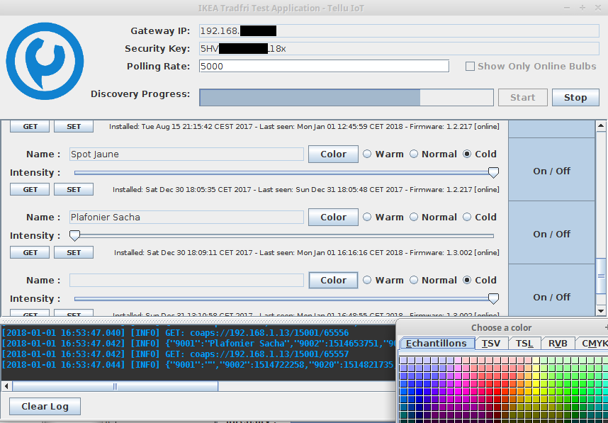
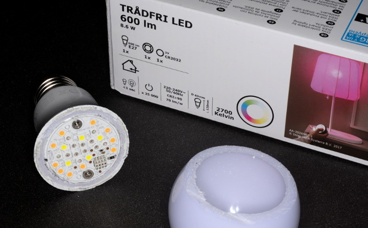
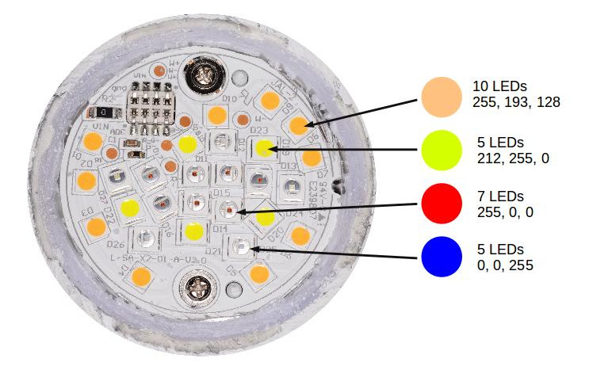

# ThingML-Tradfri

The goal of the project is to provide an event-based ThingML / JAVA API to monitor and control IKEA TRÅDFRI smart bulbs.  It is currently in an early developement stage but comes with a GUI which allow monitoring and controlling the different types of TRÅDFRI bulbs.



To compile the tradfri-java project, run `mvn clean install`

To run the GUI, run `mvn exec:java`

## IKEA TRÅDFRI LED Color Bulbs

IKEA recently released variable color bulbs. The Identification for the bulb I have got is "TRADFRI bulb E27 CWS opal 600lm" which, for now, only seem to be sold as a set with one remote control. There are not a lot of details on the box on what these bulbs are capable of. Let's open one to see how they work and what they can do.



Using the remote control only allows dimming and cycling through 9 colors:

    	        

 The first 3 colors correspond to the the 3 whites of the variable color temperature bulbs. 
 
 Using the IKEA App allows selecting 11 more colors for a total of 20: 

                                    (See further down for hex codes) 

When setting colors through the gateway only those 20 colors can be set using the hex code on property "5706". Trying anything else defaults back to the normal white color ("f1e0b5"). However more colors can be set by providing the COLOR_X and COLOR_Y on properties "5709" and "5710" respectively. Using X and Y the bulb will display a lot more colors but it does not cover the full spectrum and the maximum brightness varies greatly depending on the selected color. No deep green and no cyan are the most obvious missing colors.



Looking at the LEDs which are being used explains why the whole spectrum is not covered. The bulb has four different LED types: warm white, greenish yellow, red and blue. The RGB values I have put on the picture are aproximate but give a good idea of the color of each type of LED.

### JSON

Here is an example JSON:
```json
{
  "9001": "",
  "9002": 1514722258,
  "9020": 1514722619,
  "9003": 65557,
  "9054": 0,
  "5750": 2,
  "9019": 1,
  "3": {
    "0": "IKEA of Sweden",
    "1": "TRADFRI bulb E27 CWS opal 600lm",
    "2": "",
    "3": "1.3.002",
    "6": 1
  },
  "3311": [
    {
      "5851": 1,
      "5850": 1,
      "5707": 47822,
      "5708": 65279,
      "5709": 11469,
      "5710": 3277,
      "5706": "4a418a",
      "9003": 0
    }
  ]
}
```

Here are the Hex code for each of the preset colors:
-   	`#dcf0f8` 
-  	`#eaf6fb`
-  	`#f5faf6` 	X	[Cold White]
-  		`#f2eccf`
-  	`#f1e0b5` 	X	[Normal White]
-  	`#efd275`	X	[Warm White]
-  	`#ebb63e`	X
-  	`#e78834`	X
-  	`#e57345`
-  	`#da5d41`	X
-  	`#dc4b31`
-  	`#e491af`
-  	`#e8bedd`
-  	`#d9337c`	X
-  	`#c984bb`	X
-  	`#8f2686`
-  	`#4a418a`
-  	`#6c83ba`	X
-  	`#a9d62b`
-  	`#d6e44b`


## IKEA Variable Temperature Bulbs

These bulbs have two sets of LEDs which allow for different color temperatures. The remote control and IKEA App allow cycling through 3 different shades of white:

-  	`#f1e0b5` 	[A combination of the warm and cold LEDs]
-  	`#f5faf6`	[Only cold white LEDs]
-  	`#efd275` 	[Only warm white LEDs]

Only these 3 colors are possible when setting the color using the hex value but like for the color bulbs, using the X and Y paramenters allow for any possible color between the warm and the cold white.

Here is an example JSON:
```json
{
  "9001": "Spot Jaune",
  "9002": 1514653535,
  "9020": 1514739948,
  "9003": 65555,
  "9054": 0,
  "5750": 2,
  "9019": 1,
  "3": {
    "0": "IKEA of Sweden",
    "1": "TRADFRI bulb E27 WS opal 980lm",
    "2": "",
    "3": "1.2.217",
    "6": 1
  },
  "3311": [
    {
      "5851": 254,
      "5850": 1,
      "5711": 250,
      "5709": 24933,
      "5710": 24691,
      "5706": "f5faf6",
      "9003": 0
    }
  ]
}
```
## References

- ZigBee Light Link user guide: https://www.nxp.com/docs/en/user-guide/JN-UG-3091.pdf
- Java Implementation and some documentation from the eclipse/smarthome project (class TradfriColor has algorithms to convert between RGB and XYZ color): https://github.com/eclipse/smarthome/tree/master/extensions/binding/org.eclipse.smarthome.binding.tradfri
- Discussion on ha-bridge with a lot of info: https://github.com/bwssytems/ha-bridge/issues/570
- https://hackaday.com/2017/02/06/reverse-engineering-ikeas-new-smart-bulbs/
- https://hackaday.com/2017/06/14/ikea-tradfri-hacking/
- http://tradfri.blogspot.no/2017/04/teardown-of-ikea-tradfri-bulb-led1623g12.html


